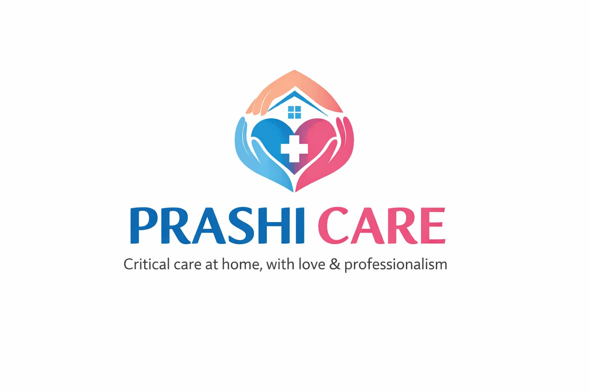

Markdown
# Prashi Care - Critical Care at Home 🏥



> **"Hospital-Grade Care. In the Place You Call Home."**

## 👨‍💻 Author & Lead Developer
**Developed & Designed by: [Your Name Here]**
*Computer Science Engineer | Full Stack Developer*

---

## 📖 Project Overview
**Prashi Care** is a modern, high-performance healthcare platform designed to bridge the gap between hospital ICUs and home comfort. This Single Page Application (SPA) serves as the digital front door for a critical care startup, enabling patients to book ICU setups, ventilator support, and skilled nursing services instantly.

This project was architected with a focus on **User Experience (UX)**, **Speed**, and **Trust**, utilizing a mobile-first approach and modern glassmorphism aesthetics.

## 🚀 Key Features
* **✨ Glassmorphism UI:** A modern, frosted-glass interface design for high-end visual appeal.
* **📱 Fully Responsive:** Optimized for all devices (Mobile, Tablet, Desktop) using Tailwind CSS.
* **⚡ High Performance:** Zero-dependency build ensuring lightning-fast load times.
* **🎨 Scroll Animations:** Integrated **AOS (Animate On Scroll)** for dynamic entry effects.
* **📨 Serverless Contact Form:** Fully functional "Request Call Back" system powered by Netlify Forms (No backend required).
* **💬 Instant Support:** Floating WhatsApp integration for direct patient-to-provider communication.
* **🔍 SEO Optimized:** Pre-configured Open Graph tags and Meta descriptions for high visibility on Google and Social Media.

## 🛠️ Tech Stack
This project uses a clean, maintainable, and scalable stack:

| Component | Technology | Description |
| :--- | :--- | :--- |
| **Structure** | **HTML5** | Semantic markup for accessibility and SEO. |
| **Styling** | **Tailwind CSS** | Utility-first CSS framework (via CDN) for rapid UI development. |
| **Scripting** | **Vanilla JS (ES6+)** | Lightweight logic for DOM manipulation and form handling. |
| **Animations** | **AOS Library** | Smooth scroll-triggered animations. |
| **Icons** | **Font Awesome 6** | Scalable vector icons for medical services. |
| **Deployment** | **Netlify** | CI/CD pipeline and serverless form handling. |

## 📂 Project Structure
A clean, organized directory structure for easy maintenance:

```bash
prashi-care/
├── index.html       # The main landing page (SEO & Content)
├── success.html     # Custom redirection page after form submission
├── style.css        # Custom overrides (Gradients, Glass effects)
├── script.js        # Core logic (Mobile Menu, Validation, Animations)
├── logo.png         # Brand Identity asset
├── hero.jpg         # Hero section visual
├── card.jpg         # About section visual
└── README.md        # Project Documentation
⚙️ Local Development Setup
To run this project on your local machine:

Clone the Repository:

Bash
git clone [https://github.com/your-username/prashi-care.git](https://github.com/your-username/prashi-care.git)
Navigate to the folder:

Bash
cd prashi-care
Run the Project:

Simply double-click index.html.

Pro Tip: Use the Live Server extension in VS Code for real-time hot reloading.

🚢 Deployment Guide
This project is optimized for Netlify but works on any static host (Vercel, GitHub Pages).

Deploying to Netlify (Recommended)
Push this code to your GitHub repository.

Log in to Netlify.

Click "New Site from Git".

Select this repository.

Build Command: (Leave Blank).

Publish Directory: . (Current directory).

Click Deploy.

Note: The Contact Form is pre-configured with data-netlify="true". No backend configuration is needed.

🗺️ Future Roadmap
I have planned the following features for the Phase 2 update:

[ ] Google Maps API Integration: To display the exact office location dynamically.

[ ] CMS Integration: Connecting a headless CMS (like Contentful) for a dynamic Health Blog.

[ ] Appointment Scheduling: Integrating Calendly or a custom booking engine for specific time slots.

[ ] Admin Dashboard: A private login area for the proprietor to view leads and manage staff schedules.

📄 License & Rights
© 2026 Prashi Care. All design, code, and architecture rights reserved by [Your Name Here]. Unauthorized reproduction or distribution of the code logic is prohibited.
